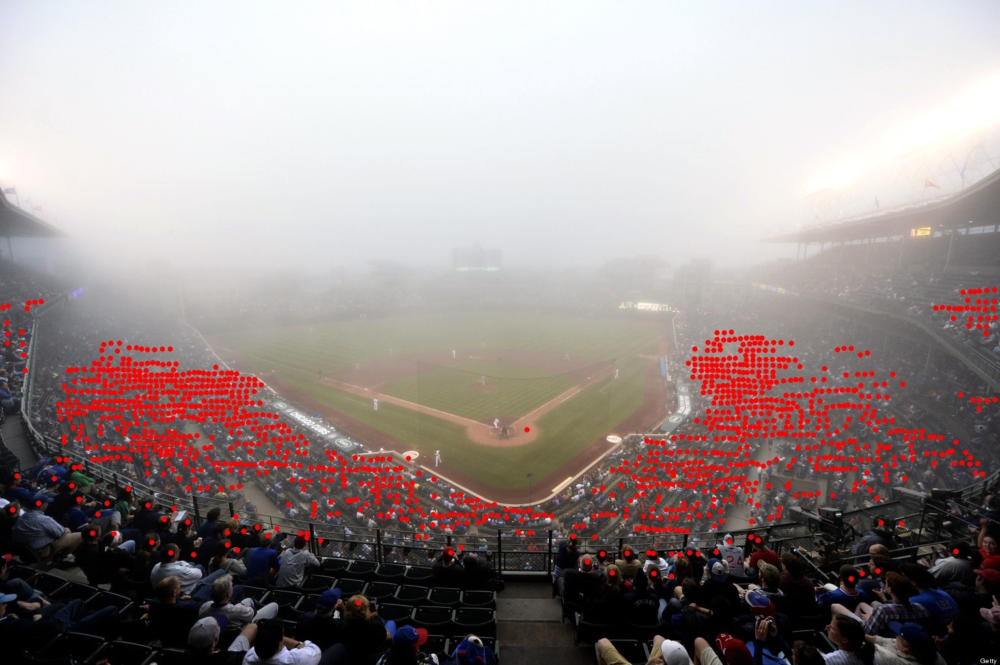
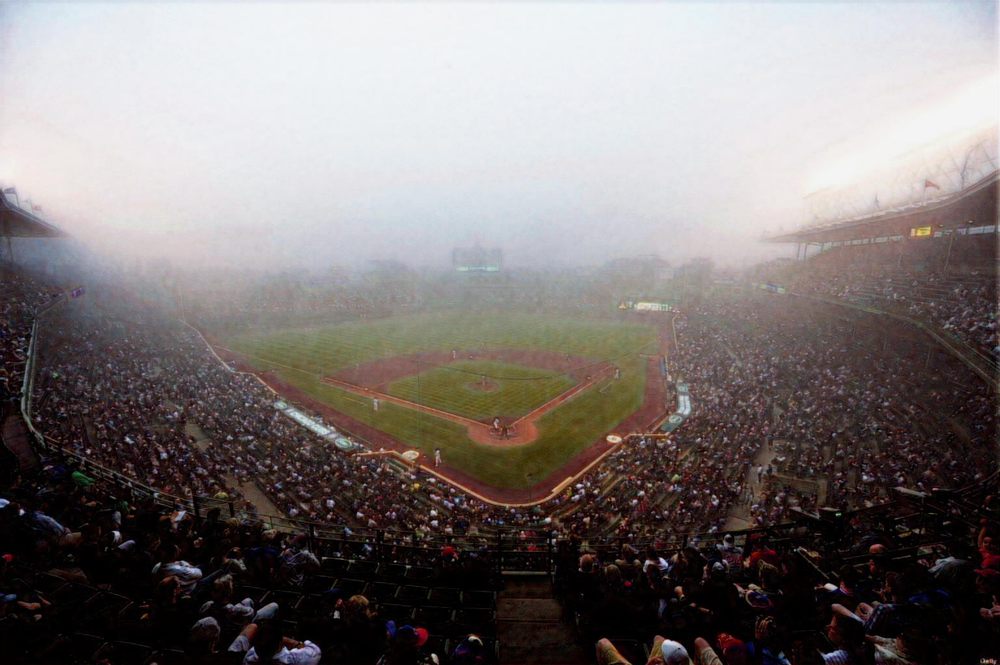

<table>
  <tr>
    <td align="center">  </td>
    <td align="center">  </td>
    <td align="center">  </td>
  </tr>
  <tr>
    <td align="center">  </td>
    <td align="center">  </td>
    <td align="center">  </td>
  </tr>
  <tr>
    <td align="center">  </td>
    <td align="center">  </td>
    <td align="center">  </td>
  </tr>
  <tr>
    <td align="center">  </td>
    <td align="center">  </td>
    <td align="center">  </td>
  </tr>
  <tr>
    <td align="center">
<b>Input</b>
</td>
    <td align="center">
<b>Ours</b>
</td>
    <td align="center">
<b>Restored Image</b>
</td>
  </tr>
</table>
