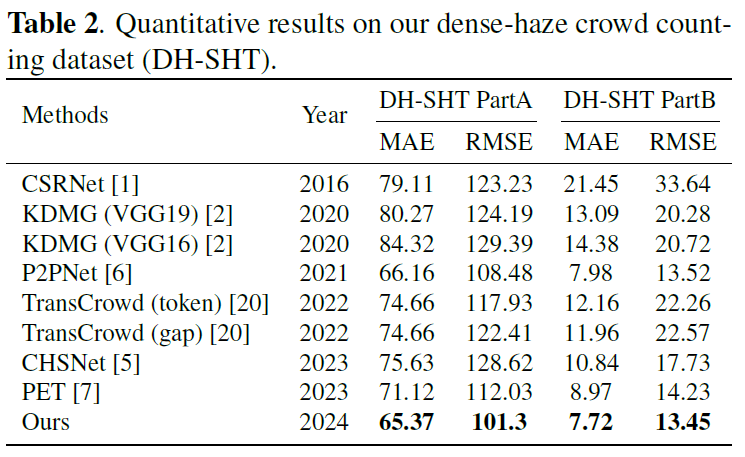

## Citation

Please cite this paper in your publications if it is helpful for your tasks.

```tex
@InProceedings{yuan2024crowd,
    author    = {Yuan, Weijun and Li, Zhan and Li, Xiaohan and Fang, Liangda and Zhang, Qingfeng and Qiu, Zhixiang},
    title     = {Crowd Counting and Localization in Haze and Rain},
    booktitle = {2024 IEEE International Conference on Multimedia and Expo (ICME)},
    year      = {2024}
}

# Dehaze-P2PNet

## [ICME 2024] 《Crowd Counting and Localization in Haze and Rain》

------

> **Abstract:** *Adverse weather conditions such as haze and fog often significantly reduce the performance of crowd counting models. An intuitive solution is to preprocess degraded images by applying image restoration techniques prior to crowd counting. However, this solution introduces additional computational complexity and may produce restored images with noise and artifacts that is harmful to the subsequent crowd counting task. To mitigate the two issues, we integrate an image restoration module (IRM) into a unified framework to propose an effective network for crowd counting and localization in haze and rain. The lightweight IRM is designed to guide the network to learn haze-aware knowledge in feature space, which is removed in the inference phase without increasing the computational cost. In addition, two new datasets are constructed to evaluate the crowd counting methods in haze and rain. Extensive experiments on both synthetic and real-world datasets demonstrate the superiority of the proposed method.*

## Datasets

| Crowd Dataset          | Link                                                         |
| ---------------------- | ------------------------------------------------------------ |
| Hazy-JHU               | [[**Google**](https://drive.google.com/file/d/1rLQ_oXHFAUqaYktk-3OFpHHk7uohEcNt/view?usp=sharing)] \| [[**BaiduNetdisk**](https://pan.baidu.com/s/1YZuWGhxZGyFmwVRntamCvA?pwd=xhcm)] |
| Hazy-ShanghaiTech      | [[**Google**](https://drive.google.com/file/d/1ibvFlZ-sdd_A6xEI1cFuXk4_hHf409Mt/view?usp=sharing)] \| [[**BaiduNetdisk**](https://pan.baidu.com/s/197CyDnxarjCL3O66yIfNwQ?pwd=jky9)] |
| Hazy-ShanghaiTechRGBD  | [[**Google**](https://drive.google.com/file/d/1rJD9IBuKA1Nhm-Ek3yDe-8V11CLKZnaG/view?usp=drive_link)] |
| Rainy-ShanghaiTechRGBD | [[**Google**](https://drive.google.com/file/d/1uCeHtVO1_Mnc3KnOKzLd0JyOUhzzKKNo/view?usp=sharing)] |

## Overview

**Comparison of crowd localization results on Hazy-JHU, DH-SHT, and Rainy-SHTRGBD.**


**Comparison of locating performance (GAME).**


## Quantitative Result

**Quantitative results on two challenging benchmark datasets.**


**Quantitative results on our dense-haze crowd counting dataset (DH-SHT).**



**Quantitative results on Rainy-SHTRGBD dataset.**


## Usage

#### Pre-trained Models

- **Hazy-JHU** → [Hazy_JHU_best.pth](https://drive.google.com/file/d/18saECAlz6mc7_neo8_uLeBrc7xs5UKVf/view?usp=sharing)
- **Hazy-ShanghaiTech PartA** → [DH_SHTA_best.pth](https://drive.google.com/file/d/1DrVEb2exzgO17ZbtoaJZctgTiqRaiuMo/view?usp=sharing)
- **Hazy-ShanghaiTech PartB** → [DH_SHTB_best.pth](https://drive.google.com/file/d/1Tu9VH0FmWyMTTwe8rqQt3gq_U2mUZGY3/view?usp=share_link)
- **Hazy-ShanghaiTechRGBD** → [Hazy_SHTRGBD_best.pth](https://drive.google.com/file/d/1jQv0Kj8aT_PGUi4LzWppiGPpXQtq15uG/view?usp=sharing)
- **Rainy-ShanghaiTechRGBD** → [Rainy_SHTRGBD_best.pth](https://drive.google.com/file/d/1Fqr7RqSJk-fSUw9YMpCg2MZnsBhynFWJ/view?usp=sharing)
- [vgg16_bn-6c64b313.pth](https://download.pytorch.org/models/vgg16_bn-6c64b313.pth)

#### Environment

```bash
torch
torchvision
tensorboardX
easydict
pandas
numpy
scipy
matplotlib
Pillow
opencv-python
```

#### Install

```bash
git clone https://github.com/lizhangray/Dehaze-P2PNet.git
pip install -r requirements.txt
```

#### Download Datasets and Pre-trained Models to Prepare Your Directory Structure

```bash
Dehaze-P2PNet
    |- assets
    |- crowd_datasets
    |- datasets
        |- Hazy_JHU
            |- test_data
            |- train_data
            |- val
        |- Hazy_ShanghaiTech
            |- PartA
                |- test_data
                |- train_data
                |- val
                ....
        |- Hazy_ShanghaiTechRGBD
        ....
    |- models
    |- util
    |- weights
        |- DH_SHTA_best.pth
        |- DH_SHTB_best.pth
        ....
        |- vgg16_bn-6c64b313.pth
    |- engine.py
    |- run_test.py
```

#### How To Test

```bash
python run_test.py --dataset_file NAME_OF_DATASET --weight_path CHECKPOINT_PATH

# e.g., Hazy-JHU
python run_test.py --dataset_file Hazy_JHU --weight_path weights/Hazy_JHU_best.pth

# e.g., Hazy-ShanghaiTech PartA
python run_test.py --dataset_file Hazy_SHTA --weight_path weights/DH_SHTA_best.pth

# e.g., Hazy-ShanghaiTech PartB
python run_test.py --dataset_file Hazy_SHTB --weight_path weights/DH_SHTB_best.pth

# e.g., Hazy-ShanghaiTechRGBD
python run_test.py --dataset_file Hazy_SHARGBD --weight_path weights/Hazy_SHTRGBD_best.pth

# e.g., Rainy-ShanghaiTechRGBD
python run_test.py --dataset_file Rainy_SHARGBD --weight_path weights/Rainy_SHTRGBD_best.pth
```

There are two parameters that must be provided:

`'--dataset_file', help='(Hazy_JHU | Hazy_SHARGBD | Hazy_SHTA | Hazy_SHTB | Rainy_SHARGBD)'`

`'--weight_path', help='load pretrained weight from checkpoint', such as 'weights/Hazy_JHU_best.pth'`

```
